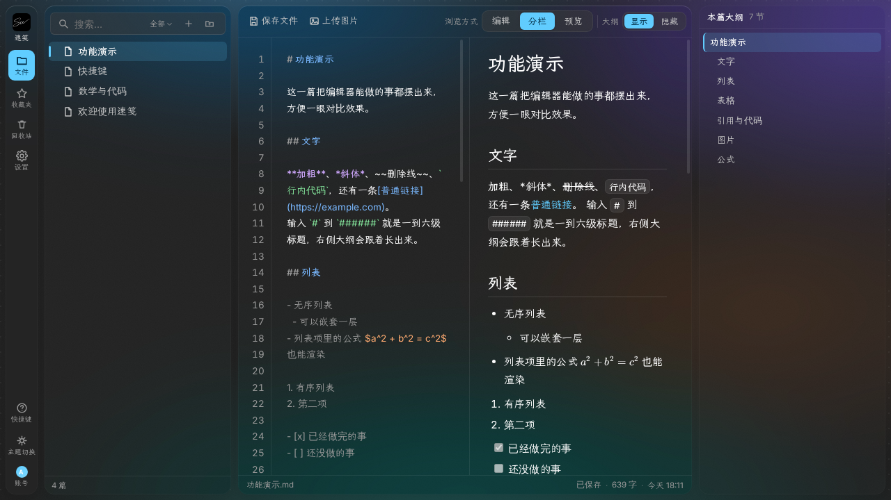
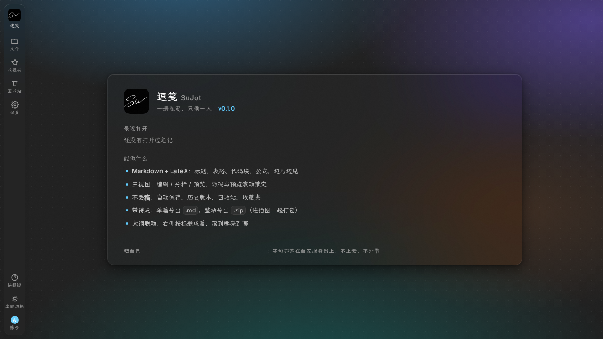

# 速笺 SuJot · 完整文档

这里是 [README](README.md) 里放不下的细节：怎么拿包、界面长什么样、怎么部署到服务器、
每一项配置的含义、数据落在哪、项目结构、设计取舍、自检工具、安全问题、常见问题。
想快速跑起来，看 [README](README.md) 的「快速开始」就够。

---

<details>
<summary><b>目录 · Table of Contents</b></summary>

| | | |
| --- | --- | --- |
| [📦 拿到手](document.md#get) | [🚀 快速开始](document.md#quickstart) | [🖼️ 界面](document.md#shots) |
| [✨ 特性](document.md#features) | [⌨️ 快捷键](document.md#keys) | [🖥️ 部署到服务器](document.md#deploy) |
| [⚙️ 配置](document.md#config) | [💾 数据放在哪](document.md#data) | [📂 项目结构](document.md#tree) |
| [🎨 设计取舍](document.md#design) | [🛠️ 自检](document.md#tools) | [🔐 安全](document.md#security) |
| [❓ 常见问题](document.md#faq) | [🙏 第三方组件](document.md#third) | [🛡️ 许可协议](document.md#license) |
| [👤 关于作者](document.md#author) | | |

</details>

<sub>[← 回到 README](README.md)</sub>

---

<a id="get"></a>

## 📦 拿到手 · Getting It

一个包：**`sujot-v0.1.0.zip`** —— 服务器部署和本机运行都是它，同一份源码、同一套目录结构。

解压出来就是项目根（`sujot-v0.1.0\server.py`、`sujot-v0.1.0\data\`），并且**自带一次干净提交的 `.git`**，
可以直接当 git 仓库用：

```bash
git remote add origin https://github.com/Primerusse/SuJot.git   # 推到自己的远端
git push -u origin main
git clone ./ 我的副本                                            # 或者复制一份自己的副本
```

也可以完全不用发布包，直接 `git clone https://github.com/Primerusse/SuJot.git`。

两条路自己挑：

| 你想 | 走哪条 |
| --- | --- |
| 在**自己电脑上**用 | 双击 `start_run_locally.cmd`（Windows）/ 跑 `./start_run_locally.sh`（Linux、macOS），详见 `docs/本机运行步骤_run_locally.md` |
| **部署到服务器**长期跑 | `sudo deploy/install-service.sh`，详见 `docs/服务器部署步骤.md` |

<a id="shots"></a>
## 🖼️ 界面 · Screenshots

<div align="center">

</div>

| 空笔记库（刚部署完的样子） | 文件栏与搜索 |
| --- | --- |
|  |  |

---

<a id="features"></a>
## ✨ 特性 · Features

**干净**
- **纯 Python 标准库**：没有任何 pip 依赖，`python3 server.py` 就能跑
- **数据即文件**：笔记是普通 Markdown（可带 frontmatter），附件在 `notes/assets/`
- **零构建**：前端是原生 JS + CSS，改完刷新就是最新

**好写**
- **写读同屏**：编辑 / 分栏 / 预览三种视图，中缝可拖、双击复位
- **自动保存 + 历史版本**：停手即存，每次保存留档，随时回看、恢复旧稿
- **大纲跳转**：按标题层级生成右侧大纲，点一下到那一段；源码与预览滚动锁定
- **Markdown + LaTeX**：内置 KaTeX，行内 / 独立公式，超宽公式只滚自己
- **粘贴即传**：`Ctrl+V` 贴进来的截图自动上传并插入；点图放大、← → 翻页
- **代码着色**：四档方案（关闭 / 经典 / 鲜明 / 柔和）

**不丢**
- **回收站**：删除先进回收站，可单项还原或一键清空（彻底删除要手输确认）
- **收藏夹**：把常翻的挑出来单独一栏，`Ctrl+D` 一按即收
- **搜索**：名称 / 内容 / 两者可选，`Ctrl+K` 全局搜索，↑↓ 挑选、回车翻开
- **导出**：单篇导出 `.md`（与磁盘源文件逐字节一致），或整目录 / 全部导出 `.zip`（插图一并打包）

**顺眼**
- **磨砂玻璃**：四块面板共用一套磨砂强度（0–100% 可调）
- **深色 / 浅色**两套主题，一套强调色贯穿始终
- **弹性动效**：侧栏、大纲收起展开带一点回弹手感（整体挂在 `html.jelly` 一个类上，去掉即回退）
- **中西文都好看**：中文霞鹜文楷、西文数字 Inter、代码 JetBrains Mono，全部自托管

**安心**
- **单管理员账号**：没有注册入口，访客一律挡在登录页外
- **默认账号 `admin` / `admin`**：首次登录必须改掉用户名和密码，没改完之前写接口一律拒绝
- **密码只以 PBKDF2 加盐哈希落盘**（`users.json`，权限 600），任何地方不留明文口令。
  启动画面也只在账号还是初始状态时提示 `admin / admin`，改过之后屏幕上不出现任何口令
- **只绑 `127.0.0.1`**：公网暴露面交给 nginx，应用本身不直接对外

---

<a id="keys"></a>
## ⌨️ 快捷键 · Shortcuts

| 按键 | 作用 |
| --- | --- |
| `Ctrl` + `K` | 全局搜索（↑↓ 挑选，回车翻开） |
| `Ctrl` + `S` | 立刻存盘 |
| `Ctrl` + `⇧` + `S` | 导出本篇为 Markdown |
| `Ctrl` + `N` | 新建笔记 |
| `Ctrl` + `D` | 收藏 / 取消收藏 |
| `Ctrl` + `B` | 收起 / 展开左侧栏 |
| `Ctrl` + `\` | 显示 / 隐藏大纲 |
| `?` | 唤出快捷键面板 |

手机端：侧栏是抽屉式，**长按文件当右键**，把手加宽了方便拖。

---

<a id="deploy"></a>
## 🖥️ 部署到服务器 · Deploy to a Server

**最省事的一条命令**（服务器上，root）：

```bash
git clone https://github.com/Primerusse/SuJot.git /srv/sujian
cd /srv/sujian && sudo deploy/install-service.sh
```

它会检查 Python 版本、建好 `/srv/sujian`，把 systemd 服务写进
`/etc/systemd/system/sujian.service` 并立刻 `enable --now`，
然后打印 nginx + 证书那几步。`--port` / `--base` / `--name` 可改端口、数据目录和服务名。

下面是从零手搓的完整版本（照它能明白每一步在干什么）。
以 Debian / Ubuntu 为例，其它发行版把 `apt` 换成对应包管理器即可。

### 0. 要准备什么

| 需要 | 说明 |
| --- | --- |
| Linux 服务器 | 1 核 1G 就够（服务常驻内存约 40–60MB） |
| Python 3.8+ | `python3 -V` 看一眼，绝大多数系统自带 |
| nginx | `sudo apt install nginx` |
| 一个域名 | A 记录解析到服务器 IP |
| sudo 权限 | 装服务、改 nginx 都要 |

### 1. 取代码

```bash
# 在服务器上直接克隆
sudo git clone https://github.com/Primerusse/SuJot.git /srv/sujian

# 或者：在自己电脑上把目录传上去
scp -r ./* root@你的服务器:/srv/sujian/
```

### 2. 先手动跑一次，确认能起来

```bash
cd /srv/sujian
sudo SUJIAN_BASE=/srv/sujian SUJIAN_PORT=8013 python3 server.py
```

看到 `速笺已启动：http://127.0.0.1:8013` 就成了 —— 首次启动会自动建目录、生成会话密钥，
并从 `assets/` 铺入 4 篇样板笔记。确认没问题后 `Ctrl+C` 停掉，交给 systemd 常驻。

> 防火墙 / 云安全组记得放行 **80 和 443**；
> **不要**放行 8013 —— 那是后端端口，只给本机 nginx 用。

### 3. 交给 systemd 常驻

```bash
sudo cp deploy/sujian.service /etc/systemd/system/sujian.service
sudo systemctl daemon-reload
sudo systemctl enable --now sujian

systemctl status sujian --no-pager        # 应显示 active (running)
curl -sI http://127.0.0.1:8013 | head -1  # 应返回 200
```

单元文件里按需改两处：`WorkingDirectory` / `SUJIAN_BASE`（数据放哪）、`SUJIAN_PORT`（端口）。
服务自带 `Restart=always`，崩了会自动拉起。

### 4. nginx 反代 + HTTPS

```bash
sudo cp deploy/nginx.conf.example /etc/nginx/sites-available/sujian
sudo sed -i 's/sujot.example.com/你的域名/g' /etc/nginx/sites-available/sujian
sudo ln -sf /etc/nginx/sites-available/sujian /etc/nginx/sites-enabled/sujian
sudo nginx -t && sudo systemctl reload nginx

sudo apt install certbot python3-certbot-nginx
sudo certbot --nginx -d 你的域名          # 自动补上 443 段和 80→443 跳转
```

示例配置**故意只写 80 端口**：证书还没申请时，配置里引用
`/etc/letsencrypt/live/...` 会让 `nginx -t` 直接失败。先跑通 80，再让 certbot 加 TLS，
这是最不容易卡住的顺序。证书续期通常是自动的，可以确认一下：

```bash
systemctl list-timers | grep certbot
```

### 5. 首次登录

打开 `https://你的域名`，用初始账号 **`admin` / `admin`** 登录。
页面会立刻要求你改掉用户名和密码 —— 改完才能真正开始写
（在此之前，保存、新建、删除等写接口一律拒绝）。

### 6. 升级

```bash
# 在服务器上拉代码
cd /srv/sujian && sudo git pull && sudo systemctl restart sujian

# 或者在自己电脑上推（本仓库自带脚本）
deploy/deploy-to-server.sh <user@host>
```

`deploy-to-server.sh` 会把静态件放进 `<远端>/static/`、后端放进 `<远端>/`，
并把 `static/vendor/` **整目录**带上 —— 漏掉它，新版 CSS 引用的字体会在线上 404。

只改 `static/` 里的文件不用重启服务，刷新浏览器即可；
改了 `server.py` 再 `sudo systemctl restart sujian`。

### 排错

| 现象 | 原因 / 处理 |
| --- | --- |
| 打开是 404 / 白屏 | 静态目录没找到。确认 `static/` 与 `server.py` 在一起，或用 `SUJIAN_STATIC` 指过去 |
| 能打开，一登录又弹回登录页 | 走的不是 HTTPS。登录 Cookie 带 `Secure`，纯 HTTP 下浏览器不保存 —— 挂上证书就好 |
| 字体或公式样式没生效，控制台一片 404 | `static/vendor/` 没传全。用 `deploy/deploy-to-server.sh`，它就是为这个坑写的 |
| 8013 端口被占用 | 改 `SUJIAN_PORT`，同时改 nginx 里的 `proxy_pass` |
| 服务起不来，日志里 `Permission denied` | 数据目录属主不对：`sudo chown -R <运行用户> /srv/sujian` |
| 服务起不来，日志提示切换工作目录失败 | 代码或数据目录在 `/tmp` 下，而单元里开了 `PrivateTmp`。改用 `/srv`，或去掉那一行 |
| 粘贴大图报 413 | nginx 的 `client_max_body_size` 调大（示例里给了 16m） |

---

<a id="config"></a>
## ⚙️ 配置 · Configuration

项目级参数集中在仓库根的 **`_config.json`** —— 所有能调的都在这里，每一项都带 `//` 注释，
改完重启服务生效。（注释是我们自己支持的：读进来之前会先剥掉 `//`，所以文件不是严格 JSON
也没关系；`http://` 这类字符串里的斜杠不会被动。）

```jsonc
{
  "port": 8013,                 // 监听端口
  "host": "127.0.0.1",          // 监听地址：建议只绑本机
  "open_browser": true,         // 本机启动时自动开浏览器
  "data_dir": "",               // 数据目录；留空＝自动（服务器 /srv/sujian，本机 ./data）
  "login_attempts": 5,          // 密码连错几次锁定
  "login_lock_seconds": 30,     // 锁定多少秒
  "upload_max_mb": 12,          // 单张正文插图上限
  "keep_history": 30,           // 每篇留多少个历史版本
  "site": { "brand": "速笺" }    // 站点初值
}
```

| 键 | 默认 | 说明 |
| --- | --- | --- |
| `port` | `8013` | 监听端口 |
| `host` | `127.0.0.1` | 监听地址，**建议保持只绑本机**，对外交给 nginx |
| `data_dir` | 空 | 数据目录。空＝自动：能写 `/srv` 就用 `/srv/sujian`，否则用 `server.py` 旁的 `data/` |
| `static_dir` | 空 | 前端静态目录，一般不用改（空＝自动找） |
| `seed_dir` | 空 | 首次启动铺样板笔记的来源，空＝仓库里的 `assets/` |
| `pass_file` | 空 | 旧版明文口令文件，只为兼容；**平时留空** |
| `open_browser` | `true` | 本机启动时自动打开浏览器（只在交互式终端里做） |
| `cookie_name` | `sujian` | 登录 Cookie 名 |
| `session_days` | `30` | 登录保持天数 |
| `max_body_mb` | `8` | 单次请求体上限（上传图片、导入用）。nginx 的 `client_max_body_size` 要不小于它 |
| `keep_history` | `30` | 每篇笔记保留多少个历史版本（超出丢最旧的） |
| `history_list_max` | `30` | 「历史版本」面板最多列多少条 |
| `login_attempts` | `5` | 密码连错几次开始临时锁定 |
| `login_lock_seconds` | `30` | 锁定多少秒 |
| `upload_max_mb` | `12` | 单张正文插图的上限 |
| `logo_max_mb` | `4` | 站点图标上限 |
| `avatar_max_mb` | `2` | 头像上限 |
| `gzip_min_bytes` | `1024` | 文本类超过这个大小才压缩（挂 nginx 时由 nginx 压，这里只影响直连） |
| `cache_days` | `365` | 带 `?v=` 的静态件在浏览器里缓存多少天 |
| `default_user` | `admin` | 初始账号名。初始口令固定是 `admin`、**不写进配置文件**；首次登录强制改掉 |
| `site` | — | 站名 / 标签标题 / 文字图标的**初值**，之后以站点设置里存的为准 |

优先级：**环境变量 > `_config.json` > 代码里的默认值**；空字符串一律当作「没设」。
这个文件可以整个删掉，删了就全走默认值。

服务器上也可以用环境变量覆盖（写进 systemd 的 `Environment=` 或 `.env` 都行）：

| 变量 | 覆盖哪个键 |
| --- | --- |
| `SUJIAN_BASE` | `data_dir` |
| `SUJIAN_STATIC` | `static_dir` |
| `SUJIAN_SEED` | `seed_dir` |
| `SUJIAN_HOST` | `host` |
| `SUJIAN_PORT` | `port` |
| `SUJIAN_SESSION_DAYS` | `session_days` |
| `SUJIAN_MAX_BODY_MB` | `max_body_mb` |
| `SUJIAN_KEEP_HISTORY` | `keep_history` |
| `SUJIAN_NO_OPEN=1` | 关掉 `open_browser` |
| `SUJIAN_CONFIG` | 指向另一份配置文件（比如 `_config.prod.json`） |

---

<a id="data"></a>
## 💾 数据放在哪 · Where the Data Lives

运行时在 `SUJIAN_BASE` 下生成 / 存放（服务器默认 `/srv/sujian`，本地试跑默认 `./data`）：

```
notes/          笔记正文（*.md）与附件（assets/）—— 你真正在乎的东西
.history/       每次保存的历史版本
.trash/         回收站
users.json      账号（口令是 PBKDF2 加盐哈希）
site.json       站名 / 标签标题 / 文字图标
order.json      文件树自定义排序
.secret         会话签名密钥（首次启动自动生成）
```

这些全部在 `.gitignore` 里，不会进仓库；备份和迁移也就是拷这一个目录。

**备份**

```bash
# 整站（含账号、历史、回收站，恢复时直接放回去）
sudo tar czf sujot-$(date +%F).tar.gz -C /srv sujian
# 只要笔记（最要紧的那部分）
sudo tar czf notes-$(date +%F).tar.gz -C /srv/sujian notes
```

想定时备份，丢一条 cron 即可（建议顺手再同步到网盘 / 另一台机器）：

```bash
0 4 * * * root tar czf /root/sujot-$(date +\%F).tar.gz -C /srv sujian
```

**恢复**就是把它拷回去：停服务 → 解包覆盖 `SUJIAN_BASE` → 起服务。

---

<a id="tree"></a>
## 📂 项目结构 · Project Structure

```
sujot/
├── start_run_locally.sh · start_run_locally.cmd      # 启动（Windows 双击 start_run_locally.cmd；服务器常驻见 deploy/）
├── server.py                 # 后端：单文件、标准库 HTTP 服务
├── _config.json              # 项目级配置：端口、目录、上传上限、站点初值……都集中在这里，带注释
├── VERSION                   # 版本号（设置 → 关于 里显示的就是它）
├── changelog.md              # 更新历史
├── static/                   # 前端（无构建步骤）
│   ├── index.html
│   ├── app.js                # 全部前端逻辑，原生 JS，无框架
│   ├── app.css
│   ├── sujot-logo*.png       # 站点 / 登录页图标（可在「设置 → 网站」里替换）
│   ├── sujot-favicon*.png
│   ├── dev-avatar-192.png    # 「设置 → 关于」里的开发者头像（换成自己的图即可）
│   └── vendor/
│       ├── katex/            # 公式渲染（随仓库分发）
│       └── fonts/            # Inter / JetBrains Mono / 霞鹜文楷（自托管）
├── assets/                   # 站点内容资源
│   ├── *.md                  # 首次启动铺入的样板笔记（4 篇）
│   └── images/               # 样板笔记的配图（落盘到笔记库的 assets/ 下）
├── deploy/
│   ├── install-service.sh    # 装成 systemd 服务（开机自启），服务器上跑这个
│   ├── sujian.service        # systemd 单元示例
│   ├── nginx.conf.example    # nginx 反代 + HTTPS 示例
│   └── deploy-to-server.sh   # 一键推静态件 + 后端到服务器
├── tools/                    # 自检脚本（不是运行必需）
│   ├── audit.py              # 全站体检：服务 / 鉴权 / 静态资源 / 笔记 / 公式 / 图片
│   ├── dom-check.py          # index.html 结构体检（容器归属、祖先链硬断言）
│   ├── prod-check.py         # 临时笔记全流程回归（新建 → 保存 → 删除 → 清理）
│   └── fetch-wenkai.sh       # 重新拉取霞鹜文楷分片字体
├── docs/                     # 两份速查 + 没装 Python 的说明 + 界面截图
└── README.md · changelog.md · LICENSE · .gitignore
```

**为什么 markdown 分了两处**：`README.md` / `changelog.md` 是「项目文档」，
GitHub 约定放根目录（首页直接渲染根 README）；而要显示在站点里的**内容型 .md
（样板笔记）统一收在 `assets/`** 下，配图在 `assets/images/`，首次启动由
`server.py` 自动铺进笔记库 —— 想改默认内容，改这里的 .md 就行。

---

<a id="design"></a>
## 🎨 设计取舍 · Design Notes

- **不做数据库**：文件系统就是数据层。备份 = 拷目录，迁移 = 拷目录，考古 = 直接看文件。
- **不做多用户**：私人笔记站，一个管理员账号，访客一律挡在门外。
- **不做前端工程化**：没有打包、没有依赖树；`static/` 里改完即生效，十年后还能打开。
- **不做富文本**：Markdown 是唯一正文格式，导出的 `.md` 与磁盘源文件逐字节一致。
- **不做同步协议**：笔记跟着服务器走，浏览器打开就用，不引入冲突合并的复杂度。
- **不内置运行时**：只依赖系统 Python 3.8+。塞一份便携 Python 进来会让仓库从
  11MB 涨到 150MB 以上，不值得。
- **后端只绑本机**：公网暴露面交给 nginx，应用本身永远监听 `127.0.0.1`。

---

<a id="tools"></a>
## 🛠️ 自检 · Self-checks

```bash
python3 tools/dom-check.py                      # 前端结构（不需要服务器）
SUJIAN_BASE=/srv/sujian python3 tools/audit.py  # 全站体检（需要服务器在跑）
```

`dom-check.py` 对 `index.html` 做硬断言，比如「JS 里引用的 id 必须存在」、
「大纲面板不许被塞回正文容器」—— 这类结构性改动最容易在重构时悄悄改坏。
`audit.py` 会逐项检查：未登录是否被挡、KaTeX 资源是否齐全、笔记树、
每篇笔记的公式括号是否配平、图片引用是否可取、附件目录、历史与回收站。

---

<a id="security"></a>
## 🔐 安全 · Security

- **初始账号 `admin` / `admin`，首次登录强制改**用户名和密码 —— 改完之前，写操作一律被服务端拒绝
- 密码**只存 PBKDF2 加盐哈希**（`users.json`），不保存明文，也不会打印到终端
- 会话令牌用 HMAC 签名，走 HttpOnly Cookie；改密码后旧会话自动失效
- 默认**只监听 `127.0.0.1`**，不对公网直接开放；外网访问一律经 nginx 反代 + HTTPS
- 登录连续输错会临时锁定；上传的图片有体积上限，请求体也有上限
- 所有笔记、账号、历史、回收站都在数据目录里，**随时可以整个拷走**

---

<a id="faq"></a>
## ❓ 常见问题 · FAQ

**笔记存在服务器上，我能直接用别的编辑器改吗？**
能。`SUJIAN_BASE/notes/` 下就是普通 `.md`，改完刷新页面即可看到。
附件放在 `notes/assets/`，正文里用 `/assets/xxx.png` 引用。

**会不会丢东西？**
三层兜底：停手即自动保存、每次保存留历史版本、删除先进回收站。
真要彻底删掉还得手输确认。再往上就是**自己定期备份**（见[数据放在哪](#data)）。

**手机上能用吗？**
能，浏览器打开就行。侧栏在窄屏是抽屉式，**长按文件 = 右键**，拖把手可调宽度。
没有独立 App —— 也不打算做。

**能多人用吗？**
不能，这是有意为之：一个管理员账号，没有注册入口，写接口都要登录。

**要装数据库、Node、Docker 吗？**
都不要。服务端一个 Python 文件，前端一堆静态文件。

**怎么把笔记整套搬走？**
拷走 `SUJIAN_BASE/notes/` 就够（里面就是你的笔记和附件）。
也可以直接在网页里「导出 zip」，会连正文引用的插图一起打包。

**为什么没有同步 / 手机端离线 / 加密？**
取舍写在[设计取舍](#design)里了：宁可功能少、坏不了。

---

<a id="third"></a>
## 🙏 第三方组件与许可 · Third-party

| 组件 | 用途 | 许可 |
| --- | --- | --- |
| [KaTeX](https://katex.org/) | 公式渲染 | MIT |
| [Inter](https://github.com/rsms/inter) | 西文与数字 | SIL OFL 1.1 |
| [JetBrains Mono](https://github.com/JetBrains/JetBrainsMono) | 代码字体 | SIL OFL 1.1 |
| [霞鹜文楷 LXGW WenKai](https://github.com/lxgw/LxgwWenKai) | 中文字体 | SIL OFL 1.1 |

字体均按 `unicode-range` 分片自托管，浏览器只下载页面上真正出现过的那几片。

<a id="license"></a>
## 🛡️ 许可协议 · License

速笺本体以 **MIT** 许可发布，见 [LICENSE](LICENSE)：
可以任意使用、修改、分发（包括商用），只需保留版权与许可声明，作者不承担担保责任。

```
Copyright (c) 2026 Primerusse
```

---

---

<div align="center"><sub>速笺 SuJot · MIT License · Copyright (c) 2026 Primerusse</sub></div>
